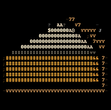

# 🥧 ASCIIpie 🥧

ASCIIpie is a Python tool that converts images to ASCII art

## Installation

```pip install ASCIIpie```

## Usage

### API

```python
from ASCIIpie import asciipie

asciipie(
    input_file='input.jpg',
    output_file='output.jpg',
    keep_color=True,
    text_mode=False
)
```

### CLI

```
ASCIIpie [-h] [-o OUTPUT] [-g] [-t] path

Convert images to ASCII art

positional arguments:
  path                  input file path

optional arguments:
  -h, --help            show this help message and exit
  -o OUTPUT, --output OUTPUT
                        output file path
  -g, --grayscale       use grayscale
  -t, --text            output to text file

```

## Example



## License

[](https://opensource.org/licenses/MIT)
